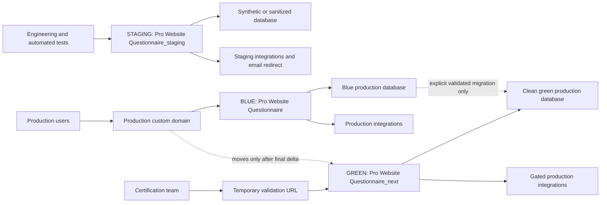
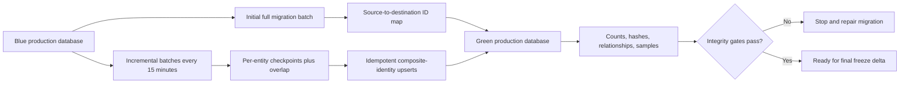
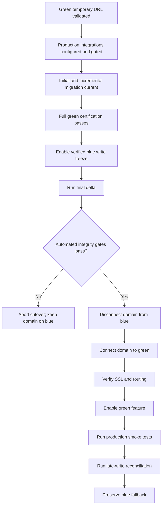
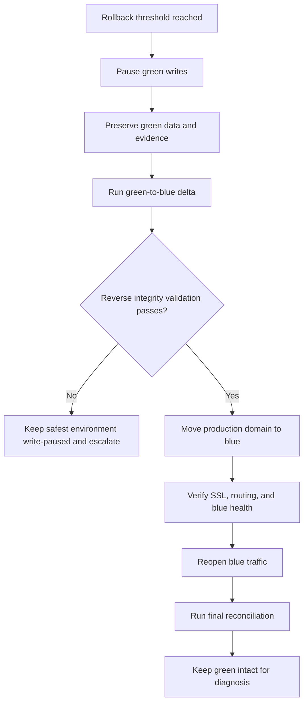
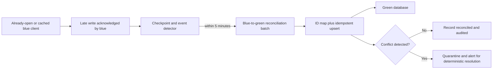

# ADR-002: Blue/Green Base44 Cutover and Data Continuity

- Status: Accepted
- Date: 2026-08-05
- Owners: Isaac Hines; Engineering
- Depends on: [ADR-001 approved product and security decisions](./ADR-001-approved-product-and-security-decisions.md)

## Context

The durable draft recovery release needs isolated testing, a clean production candidate, explicit historical-data migration, a controlled custom-domain cutover, reconciliation of writes from already-open clients, and a data-safe rollback path. A Base44 app clone, scaffold, link, or source deployment does not by itself prove that historical table records, users, secrets, uploaded files, domains, or integrations were copied.

This ADR defines the approved operational contract. The current production app remains the intact blue environment. A separate staging app is used only for development and test data. A separate clean green candidate receives migrated production data and the production domain only after certification. Production data movement must be explicit, idempotent, reversible, and validated.

No Base44 application, entity, production record, secret, integration, or domain was read or changed while accepting this ADR.

## A. Environment definitions

### Blue production

Blue is the current `Pro Website Questionnaire` Base44 production application.

- It retains the current production app identity.
- It retains the current production custom domain until the approved cutover step.
- It retains the current production database and historical records.
- It retains the current production integrations and secrets.
- It is the current and future fallback target.
- It must remain intact, addressable through an approved fallback URL, and recoverable throughout launch stabilization.
- It must not be deleted, repurposed for schema experiments, or destructively synchronized.

### Staging

Staging is a distinct Base44 application named exactly `Pro Website Questionnaire_staging`.

- It has a separate Base44 app ID assigned only when later creation is explicitly authorized.
- It has a separate Base44 database.
- It uses a built-in Base44 URL or another staging-only URL.
- It contains synthetic or approved sanitized data only; production records must not be copied into it.
- It redirects all email to an internal allowlist and prefixes subjects as required by ADR-001.
- It uses staging integrations, staging credentials, and non-production endpoints.
- It displays a persistent, visible staging banner.
- It never receives the production domain.
- It is never directly promoted into production.

### Green production candidate

Green is a distinct Base44 application named exactly `Pro Website Questionnaire_next`.

- It has a separate Base44 app ID assigned only when later creation is explicitly authorized.
- It has a separate Base44 database.
- It is a clean app generated from the exact staging-certified Git commit.
- It contains no staging test, malformed, Playwright, load-test, or debug records.
- It uses production-safe secrets and integrations that are inventoried and configured independently.
- It is validated first on a temporary non-production URL.
- It receives explicitly migrated production data rather than assuming app creation copied it.
- It receives the production domain only after migration, integrity validation, certification, and the final write-freeze delta succeed.

The app IDs and URLs are operational inventory values, not product decisions. They must be recorded in the later environment manifest after authorized app creation; they must never be guessed or committed if secret-bearing.

## K1. Blue/staging/green environment diagram

## B. Why staging is never promoted

Staging is intentionally contaminated by testing and may contain:

1. Synthetic records.
2. Deliberately malformed records.
3. Automated Playwright records.
4. Load-test records.
5. Staging email redirect settings.
6. Staging-only secrets.
7. Disabled production integrations.
8. Test hooks.
9. Visible staging UI.
10. Debug logging.

Direct promotion could leak any of those artifacts, configurations, or behaviors into production. A clean `_next` app built from the exact staging-certified Git commit separates code certification from environment state and materially reduces that risk. Staging remains staging after launch.

## C. Datasets requiring migration

The migration inventory must begin with these known production entities:

1. `ProFormSubmission`.
2. `ProFormSubmissionIntake`.
3. `ProFormDraft`.
4. `ProFormDraftEvent`.

Before migration implementation, a later repository and authorized Base44 inventory must identify every additional entity, relationship, storage location, and integration created or used by this initiative. The inventory must include:

1. Uploaded file references and the ownership/reachability of their backing objects.
2. PDF source-data references.
3. Draft-to-event relationships.
4. Draft-to-final-submission relationships.
5. Intake-to-submission relationships.
6. Retry and repair diagnostics.
7. Server-created ordering timestamps.
8. Existing session identifiers.
9. Existing submission identifiers.
10. New recovery and revision fields introduced later.
11. Records created or updated during migration windows.
12. Any future entity added by this initiative.

Authentication users, secrets, domains, and integrations are separate inventories. They must not be assumed to migrate with entity records or app creation.

## D. Migration identity and idempotency contract

Subject to later entity-schema review, migrated records need production-safe provenance metadata:

1. `source_app_id`.
2. `source_entity`.
3. `source_record_id`.
4. `source_created_date`.
5. `source_updated_date`.
6. `migration_batch_id`.
7. `migration_direction`.
8. `migrated_at`.
9. `source_content_hash`.
10. `migration_version`.

The migration contract is:

- Destination upserts use the composite identity of `source_app_id`, `source_entity`, and `source_record_id`.
- Re-running a batch updates or confirms the same logical destination record and must not append duplicates.
- Base44-generated destination IDs may differ from source IDs.
- A durable source-to-destination ID map remaps relationships wherever destination IDs differ.
- Existing business, session, intake, and submission identifiers remain stable whenever application logic or support workflows depend on them.
- Canonical content hashes use deterministic JSON normalization and exclude destination-generated IDs and migration bookkeeping fields.
- Every batch records direction, version, checkpoint, start/end time, counts, hashes, failures, retries, and reconciliation outcome.
- Checkpoints use server-created or server-updated ordering with a stable tie-breaker and an overlap window so equal timestamps or delayed visibility do not omit records.
- A rerun must be safe after partial failure, timeout, process restart, or repeated operator invocation.

This metadata is a design contract only; this prompt does not add fields or modify a schema.

## E. Migration phases

### Phase 1: Initial full blue-to-green migration

1. Inventory all eligible source records and dependencies.
2. Copy all eligible records from blue to green.
3. Build and persist relationship ID maps.
4. Inventory file references and verify whether each remains reachable or requires deliberate object copying.
5. Validate source/destination counts, content hashes, distributions, relationships, and samples.
6. Record a repeatable full-migration batch and its checkpoint.

### Phase 2: Repeated incremental blue-to-green migration

1. Copy records created or updated after the last durable per-entity checkpoint.
2. Use deterministic composite-identity upserts.
3. Maintain independent per-entity checkpoints and relationship-map progress.
4. Use an overlap window and content hashes to catch delayed or same-timestamp changes.
5. Remain safe to rerun without duplicates.
6. Run every 15 minutes by default during the pre-cutover synchronization window so the final delta stays small.

### Phase 3: Final write-freeze delta

1. Enable controlled write-freeze mode on blue.
2. Stop new questionnaire starts and final submissions.
3. Allow in-flight operations to settle within the approved short drain window.
4. Run a final blue-to-green delta for every inventoried entity and file/reference dependency.
5. Verify checkpoints, relationships, counts, hashes, and zero unresolved failures.
6. Approve the integrity report through the established automated release gates.
7. Move the domain only after every final-delta gate passes.

### Phase 4: Post-cutover late-write reconciliation

1. Continue observing blue for writes from already-open tabs, cached clients, delayed requests, and integrations.
2. Detect blue records created or updated after the freeze/cutover checkpoint.
3. Copy those writes to green through the same idempotent mapping and hash process.
4. Mark each operation with a dedicated reconciliation batch and direction.
5. Alert on same-record conflicts, relationship gaps, or non-idempotent outcomes.
6. Never silently overwrite a conflicting green change; quarantine and resolve it under a documented conflict rule.

### Phase 5: Green-to-blue rollback delta

1. Pause green writes while preserving green data.
2. Copy every green-created or green-updated production record since the last common checkpoint back to blue.
3. Apply reverse source/destination mappings and deterministic upserts.
4. Validate reverse counts, hashes, relationships, identifiers, files, and samples.
5. Require zero unresolved reverse-migration failures.
6. Move the production domain back only after reverse validation succeeds.

The reverse path must be implemented and tested in staging with representative data before launch approval.

## K2. Initial and incremental migration diagram

## F. Controlled write-freeze mode

The release requires an application-level write freeze; DNS timing alone is insufficient.

1. Prevent new questionnaire starts on blue.
2. Prevent new final submissions on blue.
3. Preserve all already-saved client drafts.
4. Present a clear maintenance message with safe retry guidance.
5. Allow safe read-only recovery where technically possible.
6. Permit authorized operations staff to inspect migration status without unrestricted client access.
7. Record the freeze start time, drain completion time, final-delta start/end, domain cutover time, and freeze end time in UTC.
8. Do not rely solely on DNS, browser caching, or domain detachment to stop writes.
9. Keep the freeze as short as practical by completing full and incremental migration first.
10. Do not move the production domain before final reconciliation and all integrity gates pass.

If the freeze cannot be enforced or its scope cannot be verified, cutover stops.

## G. Integrity validation contract

Every full, incremental, final, reconciliation, and reverse batch must produce a machine-readable integrity report containing at least:

1. Source count by entity.
2. Destination count by entity.
3. Status-distribution comparison.
4. Created-date range comparison.
5. Updated-date range comparison.
6. Null/non-null field-distribution comparison.
7. Canonical JSON hash comparison.
8. Relationship completeness.
9. Random-sample deep comparison.
10. Proof that all submitted records retain final submission IDs.
11. Proof that all drafts retain session IDs.
12. Proof that all events map to the correct draft and session.
13. Proof that file URLs remain reachable or were copied deliberately and remapped.
14. Proof that no test or staging record entered green.
15. Zero unresolved migration errors before cutover.

Integrity failure is fail-closed. The migration may be repaired and rerun idempotently, but a failed report cannot be waived by moving the domain first.

## H. Production domain cutover contract

The approved cutover sequence is strictly ordered:

1. Green is available on its temporary validation URL.
2. Green production integrations are configured but gated.
3. The initial full migration is complete.
4. Repeated incremental migration is current.
5. Full green certification is complete.
6. Blue write freeze is enabled and verified.
7. The final delta is complete.
8. The integrity report is approved automatically under established release gates.
9. The production domain is disconnected from blue.
10. The production domain is connected to green.
11. SSL certificate, routing, canonical redirects, and health are verified.
12. The green durable-draft feature is enabled through the separate approved activation step.
13. Production smoke tests run against the custom domain without exposing or corrupting client data.
14. Late-write reconciliation runs and continues through the launch observation window.
15. Blue is preserved on its built-in Base44 URL or a restricted fallback URL.

The exact same-workspace Base44 domain-transfer procedure, including permissions, detachment/attachment behavior, certificate issuance, expected delay, and reversal steps, must be rehearsed in a non-production domain or explicitly confirmed with Base44 before launch. Confirmation is recorded as release evidence; it is not assumed from this ADR.

## K3. Domain cutover diagram

## I. Rollback contract

### Trigger thresholds

Rollback evaluation begins immediately when any one of these occurs during the launch observation window; the incident commander may decide to roll back earlier:

1. Any confirmed loss, corruption, cross-client exposure, duplication, or broken relationship involving a server-acknowledged production record.
2. Draft save/recovery or final-submission failure rate at or above 5% for five consecutive minutes, excluding intentional abuse-control rejection.
3. HTTP 5xx or fatal client-startup failure rate at or above 5% for five consecutive minutes, or three consecutive production smoke-test failures.
4. Production domain, SSL, or routing remains invalid for ten minutes after attachment.
5. An authorization failure grants cross-client access or direct unrestricted entity access.
6. A late-write or migration conflict remains unreconciled beyond the five-minute detection target and threatens acknowledged data.

These are provisional release thresholds and must be exercised with representative staging telemetry before launch. A security or data-integrity incident never waits for a percentage threshold.

### Ordered rollback sequence

1. Declare rollback, record the decision time, and communicate the write state.
2. Pause green starts, writes, and final submissions.
3. Preserve green data, logs, checkpoints, mappings, files, and diagnostic evidence.
4. Run the idempotent green-to-blue delta from the last common checkpoint.
5. Verify the reverse migration with the full integrity contract.
6. Reassign the production domain to blue only after reverse verification succeeds.
7. Verify SSL, routing, redirects, and blue health.
8. Reopen blue traffic under controlled monitoring.
9. Run a final bidirectional reconciliation for requests that crossed the pause/cutover boundaries.
10. Preserve green intact for diagnosis and possible forward recovery.
11. Never move the domain back first and synchronize data later.
12. Never delete green during incident response.

If reverse migration cannot achieve verified data continuity, the domain remains on the safest write-paused environment while the data incident is escalated. Restoring traffic without acknowledged records is not an acceptable shortcut.

## K4. Reverse rollback migration diagram

## Late-write reconciliation contract

Already-open blue tabs or cached blue clients may continue calling blue after the custom domain moves. Domain cutover therefore does not establish a complete write boundary.

- Blue remains observable for new or updated records after the freeze checkpoint.
- Detection compares server-created/server-updated timestamps, source identities, content hashes, and event streams against durable checkpoints.
- Detection runs continuously with a target of identifying late writes within five minutes during the launch observation window.
- Each discovered write enters an explicitly identified blue-to-green reconciliation batch.
- Idempotent upserts and relationship maps carry the late write to green.
- Same-record divergent edits are quarantined and alerted; they are not silently resolved by client time or unconditional last-write-wins.
- Reconciliation reports remain part of release evidence until the observation window closes with zero unresolved late writes.

## K5. Late-write reconciliation diagram

## J. Provisional RPO and RTO release targets

These production-minded targets are acceptance gates that require validation with representative data and operations in staging:

1. Rollback data-loss objective: RPO 0 for server-acknowledged records when reverse migration succeeds.
2. Source/application rollback objective: RTO within 30 minutes after the rollback decision, excluding external DNS or SSL delays outside application control.
3. Migration checkpoint frequency: frequent enough that the final delta remains small, with a default of every 15 minutes during the pre-cutover synchronization window.
4. Late-write detection target: within 5 minutes during the launch observation window.

An RPO 0 target is not a claim of success until forward migration, reverse migration, interruption recovery, relationship remapping, and late-write reconciliation all pass staging evidence. External DNS/SSL delay is measured and reported separately from application-controlled RTO.

## L. Explicit prohibitions

1. No direct staging promotion.
2. No CSV-only append migration.
3. No production domain move before final validation.
4. No deletion of blue.
5. No rollback domain move before reverse synchronization and validation.
6. No production data copied to staging.
7. No production secret committed to Git.
8. No assumption that a Base44 clone, scaffold, link, or deployment includes all records, users, secrets, domains, files, or integrations.
9. No destructive schema experimentation on blue.
10. No migration process that cannot be rerun idempotently.

## Consequences and release evidence

- Green production readiness depends on both code certification and clean environment certification.
- Migration tooling must support forward, incremental, reconciliation, and reverse directions before launch.
- Operational inventory must treat entity records, files, users, secrets, integrations, and domains as distinct resources.
- The final freeze and domain transfer are fail-closed release gates, not scheduling formalities.
- Blue consumes resources through stabilization because it is a preserved fallback, not disposable legacy infrastructure.
- Release evidence must retain sanitized environment identifiers, commit SHA, migration version, batch/checkpoint history, ID-map integrity, count/hash reports, conflict reports, timestamps, domain/SSL observations, smoke results, and rollback rehearsal results.

## Supersession and documentation-only statement

Any change to environment roles, migration identity, integrity gates, cutover ordering, rollback ordering, or RPO/RTO targets requires a version-controlled superseding ADR approved by Isaac Hines and Engineering. Implementation cannot silently weaken this contract.

This prompt created documentation only. It did not create or link blue, staging, or green apps; run a Base44 command; access or export production records; create migration code; change an entity schema; configure a secret or integration; deploy source; move a domain; change application behavior; push the feature branch; or push `main`.
