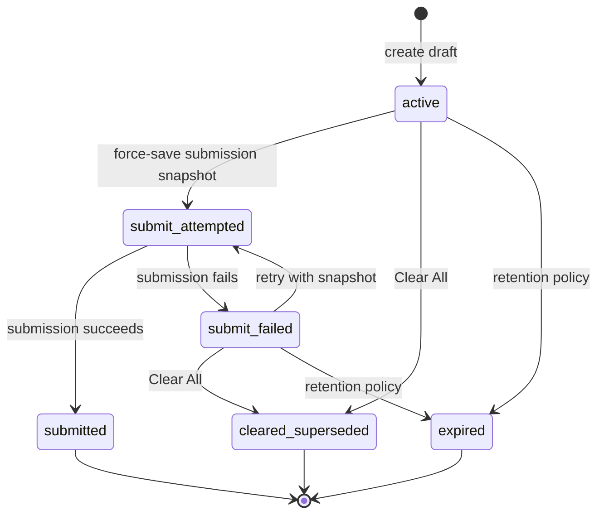

# ADR-003: Draft Identity, Recovery, and Lifecycle Contract

- Status: Accepted
- Date: 2026-08-05
- Owners: Isaac Hines; Engineering
- Depends on: [ADR-001 approved product and security decisions](./ADR-001-approved-product-and-security-decisions.md); [ADR-002 blue/green cutover and data continuity](./ADR-002-blue-green-base44-cutover-and-data-continuity.md)

## Context and decision

Durable draft recovery requires one unambiguous identity, selection, authorization, revision, supersession, submission, administration, and retention contract. This ADR defines that contract before implementation. It extends the logical use of the existing `ProFormDraft` snapshot and `ProFormDraftEvent` audit entities; it does not replace either entity and does not authorize a schema change.

Server time and server-issued identifiers are authoritative for cross-client ordering. Browser state is a cache, not the authority. An unverified recovery email is an association and an accepted initial-release recovery input; it is not proof that the client owns the address. A raw recovery code is an ephemeral secret and is never a persisted field.

## A. Terminology

1. **Draft:** One durable questionnaire record with one immutable draft ID, one client session ID, one lifecycle status, one recovery-code credential, and a current canonical state. A draft remains the same draft across autosaves and recovery, but not across Clear All or Start New.
2. **Active draft:** A draft in `active` whose canonical state may accept ordinary edits under the revision contract.
3. **Submitted questionnaire:** A draft in terminal status `submitted`, linked to its final submission and immutable submitted/PDF source snapshot. Recovery renders it read-only.
4. **Recovery email:** The email association supplied by an invitation, client, recovery flow, administrator, or migration. In the initial release it may be used for recovery while `unverified`.
5. **Normalized recovery email:** The validated, trimmed, full-lowercase lookup form of the recovery email. The originally entered display form is preserved separately when needed.
6. **Recovery-code hash:** A versioned secure hash or keyed hash computed from a normalized, high-entropy draft code. It is the persisted lookup/verifier; it is not the raw code and must not make raw-code recovery practical.
7. **Recovery session:** Short-lived, server-authorized state proving a permitted recovery method for a specific draft and scope. It returns only scoped data and is not a direct entity credential.
8. **Signed invitation:** A server-verifiable invitation carrying bounded questionnaire context and, when present, an email claim. An unchanged valid claim may establish `verified_signed_invitation`; changing it removes that basis for the replacement address.
9. **Client session ID:** A cryptographically random server-generated identifier for one questionnaire session. It remains stable for that draft, differs from the Base44 record ID, and rotates when Clear All or Start New creates a draft.
10. **Draft ID:** The immutable server record identifier for one `ProFormDraft`. Clear All and Start New create a different draft ID.
11. **Client revision:** A nonnegative, monotonically increasing revision generated within the client coordination model for proposed canonical-state changes. It cannot order records globally.
12. **Server revision:** A monotonically increasing integer assigned by the server for each accepted mutation of a draft and used as the authoritative concurrency boundary.
13. **Canonical state:** The complete, deterministically serialized, answer-bearing questionnaire state accepted by the server, including serializable answers, validation, touched/expanded state, incomplete editor values, uploaded URLs, and safe upload metadata.
14. **Compatibility JSON fields:** Existing serialized fields such as `responses_json`, `validation_status_json`, `touched_questions_json`, `expanded_questions_json`, `metadata_json`, `userdata_json`, `mapped_payload_json`, and `draft_metadata_json` retained during rollout for compatibility. They are derived from or reconciled with canonical state; they are not competing authorities.
15. **Cleared/superseded draft:** An immutable historical draft in `cleared_superseded`, linked to its replacement and excluded from automatic email recovery. It remains available under support, audit, and retention policy.
16. **Source tab ID:** A random, per-tab identifier attached to field-change metadata. It helps diagnose and merge concurrent edits but is not a user identity or global ordering source.
17. **Field-change metadata:** Per field/question metadata containing its ID, client change time, source tab ID, and base server revision. It supports non-overlapping merges and same-field conflict detection.
18. **Administrative recovery grant:** A backend-signed, environment- and scope-limited browser grant issued after password verification. It has no fixed initial-release expiry, never conveys unrestricted entity credentials, and remains revocable.
19. **Blue app:** The intact current production Base44 application and fallback defined by ADR-002.
20. **Green app:** The clean `_next` production candidate defined by ADR-002, populated by explicit validated migration and eligible for the production domain only after acceptance gates pass.

## B. Normalized email contract

### Normalization and storage

1. Trim leading and trailing Unicode whitespace before validation.
2. Parse the address as one mailbox; reject syntactically invalid addresses, multiple addresses, missing local/domain portions, or values outside the accepted length and character policy.
3. Lowercase the domain portion.
4. Apply one consistent local-part policy: the production lookup representation lowercases the local part as well. Therefore, the default normalized lookup value is the fully lowercased valid email.
5. Preserve the trimmed originally entered form separately as the display value when display or support use requires it. Display form never participates in matching.
6. Compute the email lookup key with a versioned keyed hash of the normalized email. Equality lookup uses that hash rather than raw email.
7. Store logically: `recovery_email_display`, `recovery_email_normalized`, `recovery_email_lookup_hash`, `email_source`, and `verification_status`. The normalized value and display value are sensitive even though the lookup hash is preferred operationally.
8. Never put a raw display or normalized email in browser-storage key names. Browser keys use opaque draft/session identifiers.
9. Never log raw email in rate-limit, abuse, or recovery diagnostics when the keyed lookup hash is sufficient. Redaction applies to request URLs, exception context, analytics, and event payloads.

### Provenance and verification

`email_source` is exactly one of:

- `signed_invitation`
- `client_entered`
- `recovered_by_email`
- `admin_corrected`
- `migrated_legacy`

`verification_status` is exactly one of:

- `unverified`
- `verified_otp`
- `verified_magic_link`
- `verified_signed_invitation`

The initial release may associate a draft and authorize email-only recovery with `unverified`. That accepted product behavior does not verify address ownership and must not be described as verification. `verified_signed_invitation` applies only when a valid signed invitation proves the unchanged email claim; it does not transfer when the client changes the address. OTP and magic-link states cannot be assigned while their workflows are disabled.

## C. Recovery code contract

### Issuance and representation

1. Every draft receives exactly one current recovery code at creation or deliberate rotation.
2. The generator uses a cryptographically secure source and provides at least 80 bits of effective entropy; implementations should provide 100 bits or more.
3. The display form uses short human-readable groups separated by hyphens.
4. The alphabet excludes `0`, `O`, `1`, `I`, and `L`.
5. Input is case-insensitive when the selected alphabet permits it.
6. Verification removes permitted spaces and hyphens, applies the alphabet's canonical case, rejects invalid characters or length, and then hashes the canonical value.
7. The persisted representation contains only a versioned secure hash or keyed hash, its code version, and—only if specifically approved for support display—a safe last-four hint.
8. The raw code is never stored in Base44, event rows, logs, analytics, browser-storage key names, error reports, or migration metadata.
9. The raw code is returned only at one-time initial issuance or deliberate rotation. A later response may show it only when the current recovery session already proves possession of that same code. Ordinary reads never return it.
10. The code is never placed in ordinary query parameters. A recovery UI accepts it in a request body over TLS and must prevent analytics capture.

### Rotation

A new draft, Clear All, and Start New each issue a code for the newly created draft. An explicit administrative reset rotates the code on its target draft and increments the code version. Any rotation atomically replaces the verifier and invalidates the prior code for that draft. A new code is not derivable from the former code, email, draft ID, session ID, timestamp, or version. Code authorization remains independent of email authorization.

## D. Draft status state machine

### Statuses

| Status | Meaning |
| --- | --- |
| `active` | Editable current draft. |
| `submit_attempted` | Complete immutable submission snapshot has been force-saved and submission is in progress or awaiting an authoritative outcome. |
| `submit_failed` | Submission failed; complete answers remain recoverable and a new attempt is allowed. |
| `submitted` | Terminal successful submission; ordinary edits, Clear All, and status regression are forbidden. |
| `cleared_superseded` | Terminal historical draft replaced through Clear All and excluded from automatic email recovery. |
| `expired` | Retention/recovery policy has made the draft unavailable to ordinary recovery. |
| `deleted` | Optional soft-delete state used only if the platform requires it; it is excluded from all public recovery. This ADR authorizes no ordinary transition into or out of it. |

`New` in the diagram is a creation pseudo-state, not a persisted status.

### Allowed transitions

The complete ordinary transition set is:

1. `New -> active`
2. `active -> submit_attempted`
3. `submit_attempted -> submitted`
4. `submit_attempted -> submit_failed`
5. `submit_failed -> submit_attempted`
6. `active -> cleared_superseded`
7. `submit_failed -> cleared_superseded`
8. `active -> expired`
9. `submit_failed -> expired`



### Prohibited transitions and guards

The following are forbidden:

1. `submitted -> active`
2. `submitted -> submit_attempted`
3. `submitted -> submit_failed`
4. `submitted -> cleared_superseded` through Clear All
5. `cleared_superseded -> active`
6. `expired -> active` without an explicit, privileged migration or administrative operation
7. Any transition caused by a stale lower revision

`submitted` protection wins over every autosave, retry, merge, migration replay, or delayed response. A privileged recovery of an expired record is outside the ordinary state machine: it must be explicitly authorized, preserve the prior status in audit history, use a current server revision, and follow an approved migration or administration procedure. Adding a normal `deleted` transition requires a later approved retention contract.

## E. Email-recovery selection

Automatic email recovery considers only `active`, `submit_attempted`, `submit_failed`, and `submitted`. It excludes `cleared_superseded`, `expired`, and `deleted`.

The server executes this deterministic algorithm:

1. Normalize and validate the supplied email under section B; invalid input receives the generic public outcome.
2. Apply per-IP and per-email-hash rate limits, increasing delays, suspicious-attempt CAPTCHA, temporary lockouts, and auditable abuse checks before revealing a result.
3. Compute the versioned keyed hash of the normalized email.
4. Filter records to an exact hash match and the eligible statuses.
5. Sort by the platform's server-created timestamp descending.
6. If server-created timestamps are equal, sort by immutable draft ID descending using one documented bytewise comparison.
7. Select exactly the first record, which is the newest-created eligible draft.
8. Never use a client-provided timestamp for selection.
9. Never select by the most recently updated date. A later update to an older draft does not make it newest and does not reactivate it.
10. Create a recovery session scoped to the selected draft and record the authorization method and safe audit outcome.

If the selected record is `submitted`, it opens read-only and offers **Recover a different questionnaire**. Only after successful recovery authorization may that choice list other eligible records for the same association, identified only by safe business name, server-created date, and status. Choosing an older record does not change creation ordering or status.

## F. Recovery-code selection

The server executes this deterministic algorithm:

1. Normalize the entered code under section C and reject invalid syntax through a generic public response.
2. Apply code-attempt abuse controls and compute the configured versioned secure/keyed hash.
3. Locate the exact matching non-`deleted` record without requiring or comparing email.
4. Permit direct recovery for `active`, `submit_attempted`, `submit_failed`, or `submitted`, scoped to that exact draft.
5. Render `submitted` read-only under section I.
6. For `cleared_superseded`, return a safe supersession message. Because the valid old code proves authorization to that old draft, the response may state that a replacement exists and provide a safe recovery route, but it never reveals the replacement code or bypasses authorization for the replacement.
7. For `expired`, follow the approved retention/recovery policy; do not silently reactivate it.
8. Use generic public failures for malformed, unmatched, expired, locked, and otherwise unavailable attempts wherever a distinction would aid enumeration. Audit the specific internal outcome using safe hashes and identifiers.

Possession of a valid code authorizes only its draft and permitted view/action scope. It does not authorize other drafts sharing an email.

## G. Opening modal flow

The opening modal always appears. It uses one email field and does not require a confirm-email field.

1. Bootstrap recovery and draft identity before the interactive form can autosave.
2. Validate any signed invitation; a valid invitation may prefill its email claim.
3. Offer exactly these paths: **Continue with email**, **Change email**, **Continue without email** after an explicit recovery-risk acknowledgement, or **Recover existing draft**.
4. If the valid signed email remains unchanged, associate it with the new or current invitation draft and retain its signed-invitation provenance and verification state.
5. If the client changes the signed email, do not query or open the replacement email's existing drafts automatically. Treat the replacement as `client_entered` and `unverified`, and create or associate a new draft for the current questionnaire context.
6. If the client continues without email, create/continue the draft without an email association only after recording the acknowledgement that recovery may depend on retaining the code.
7. Display the current draft's code and provide a copy control under the one-time issuance/possession rules.
8. Keep autosave blocked until the server draft and canonical state are resolved; the empty initial Redux state must never overwrite a recovered server draft during modal processing.
9. Record the modal path, acknowledgement boolean, server time, and safe draft/session identifiers. Do not record unnecessary raw invitation, email, code, or browser data.

## H. Clear All flow

Clear All is a server-coordinated supersession transaction, never an in-place reset:

1. Cancel or coalesce pending ordinary client saves for the old draft and block new ones.
2. Obtain or confirm the latest server revision and canonical hash for the old draft.
3. With a compare-and-set revision guard, transition the old `active` or `submit_failed` draft to `cleared_superseded`.
4. Record server-generated `superseded_at`, `superseded_reason`, and the eventual `replacement_draft_id` on the old logical record.
5. Create a separate new empty `active` draft; never reuse or clear the old record in place.
6. Record `previous_draft_id` and an incremented generation/sequence on the new draft.
7. Retain the normalized recovery email, display value where needed, lookup hash, email source, and verification status without upgrading verification.
8. Generate a new cryptographically random client session ID.
9. Generate a new independent recovery code and persist only its versioned verifier.
10. Ensure the new record receives a server-created timestamp strictly after the old record's server-created timestamp. Creation and linkage are completed server-side; client time cannot establish ordering.
11. Save a deterministically serialized empty canonical state and its initial revisions/hash on the new draft.
12. Clear only application-managed browser cache belonging to the old draft. Do not claim to erase browser history, browser telemetry, or external copies.
13. Establish the new recovery session, display the new one-time code, and provide copy guidance.
14. When an email association exists, enqueue/trigger the environment-routed SES delivery for the new code after durable creation.
15. If SES delivery fails, keep the new draft `active`, keep its code visible, record a safe email-delivery-failure event, and ask the client to copy it; never roll back to the old draft.
16. Reject every delayed or stale save for the old draft by status, draft ID, session ID, and server-revision guards. A save addressed to the old draft can never mutate the replacement.
17. Append auditable `clear_requested`, `draft_superseded`, `replacement_draft_created`, and email-delivery outcome events with server time and safe identifiers.

If the atomic old/new record operation cannot complete, the old draft remains in its prior state and no replacement is presented. Retrying uses an idempotency key so it cannot create multiple replacements. Clear All is unavailable for `submitted`.

## I. Submission flow

1. Cancel the ordinary autosave debounce and prevent a concurrent ordinary save from overtaking submission.
2. Complete validation and capture the entire post-validation canonical state.
3. Force-save that state and transition to `submit_attempted` with a current revision guard.
4. Submit using the exact immutable response snapshot saved in step 3; do not remap from subsequently changing browser state.
5. On success, transition to `submitted`, store `final_submission_id`, lock ordinary edits, and preserve the immutable submitted and PDF source snapshot.
6. On failure, transition to `submit_failed`, store a safe failure classification, and preserve every answer and the attempted snapshot for recovery/retry.
7. Reject old autosaves or delayed submission responses that would regress `submitted`, regardless of their payload or client time.
8. Recovered `submitted` records render all permitted answers read-only and can generate/download the PDF from the submitted snapshot.
9. **Start a New Questionnaire** creates a separate blank `active` draft with a new draft ID, session ID, recovery code, server-created timestamp, and generation link; it leaves the submitted record and its code unchanged.
10. PDF generation resolves the submitted draft's preserved PDF source snapshot by submitted draft/final submission identity, never the newest blank draft for the email.

Retries from `submit_failed` repeat the force-save/snapshot discipline and transition through `submit_attempted`. An unresolved `submit_attempted` outcome must be reconciled idempotently by submission identity before permitting a retry that could duplicate the final submission.

## J. Revision and conflict contract

1. Each accepted client-originated canonical-state change carries a monotonically increasing client revision within its draft/client coordination context.
2. Each accepted server mutation increments the draft's monotonic server revision exactly once.
3. Canonical state has a stable cryptographic hash over deterministic serialization and its contract version.
4. Same client revision and same canonical hash is an idempotent success and does not append a duplicate mutation.
5. Same client revision and a different canonical hash is a conflict and is never accepted as an idempotent retry.
6. A lower client revision or a mutation based on a lower server revision is rejected as stale unless the merge rule in step 10 explicitly applies.
7. A higher valid client revision based on the current server revision, with an allowed status transition and valid state, is accepted and advances the server revision.
8. Every changed field/question carries its field/question ID, changed-at client time, source tab ID, and base server revision.
9. Client time is diagnostic metadata; it is never authoritative for record selection, lifecycle ordering, or unconditional last-write-wins.
10. Non-overlapping changes from the same valid base may merge deterministically by field/question ID. The server applies them to the latest canonical state, recomputes the hash, and issues a new server revision while retaining both change records.
11. Same-field concurrent changes do not merge silently. The server returns a user-visible conflict containing safe current/proposed values and revisions; the client's explicit choice is submitted as a new higher revision. If a field cannot be displayed safely, the deterministic choice is to retain the current server value and require re-entry.
12. Submitted-state protection always wins. No merge, stale save, same-field choice, retry, compatibility-field write, or delayed response can alter answers or regress status after `submitted`.

Compatibility JSON fields are written as a server-controlled projection of the accepted canonical state during migration. A compatibility projection cannot independently advance the revision or overwrite canonical state.

## K. Administrative recovery grant contract

1. Verify the support/admin password only in a rate-limited backend function using a secret-held verifier.
2. After successful verification, issue a signed, integrity-protected recovery grant; the raw password is never returned or persisted.
3. The initial-release grant has no fixed time expiration and may survive browser restarts when persistent storage is available. This accepted behavior does not make the grant irrevocable.
4. Include signed claims for grant version, environment, permitted scope, issued-at server timestamp, and a device/browser binding hash where technically practical. Include an opaque grant ID to support audit correlation without logging the token.
5. Invalidate grants through any of: signing-secret rotation, a required grant-version increment, **Forget This Device** deleting the local grant and recording revocation where supported, or browser-storage clearing. Every privileged request revalidates signature, current environment, current version, scope, and binding.
6. Rate-limit password attempts by safe network/device signals, apply increasing delays and temporary lockouts, and return generic errors.
7. Store the grant outside Redux and never place it in a URL, query string, analytics payload, log, or entity row.
8. Never return Base44 credentials or direct unrestricted entity access. The grant authorizes only named backend recovery operations and scoped projections.
9. Audit password outcomes, grant issuance, privileged lookup/view/action, forgetting, version rejection, and revocation using server time, safe actor/device correlation, target IDs, scope, and outcome.
10. A future migration replaces the shared password flow with individually authenticated, least-privilege admin identities, per-admin audit attribution, and centrally revocable sessions. Existing grant version/scope checks provide the invalidation boundary; legacy grants are revoked rather than promoted.

The absence of a fixed expiration means a valid stored grant continues until one of the revocation conditions occurs. Operators must rotate the secret or increment the required version for fleet-wide revocation.

## L. Future OTP and magic-link framework

All four controls default to and remain exactly disabled for the initial release:

```text
PRO_DRAFT_EMAIL_OTP_ENABLED=false
PRO_DRAFT_MAGIC_LINK_ENABLED=false
VITE_PRO_DRAFT_EMAIL_OTP_ENABLED=false
VITE_PRO_DRAFT_MAGIC_LINK_ENABLED=false
```

The future-compatible logical fields are:

1. `verification_status`
2. `verification_method`
3. `verification_requested_at`
4. `verification_completed_at`
5. `otp_attempt_count`
6. `magic_link_version`
7. `verification_token_hash`
8. `verification_expires_at`

These fields may be added before activation as non-required, backward-compatible fields. Their presence does not enable a workflow. In the initial release, no OTP or magic link is required, no OTP or magic-link challenge authorizes recovery, and no client UI exposes issuance, entry, resend, or completion for these disabled workflows. Server and client flags must both permit a workflow before any future UI or authorization path can activate.

The stable draft ID, client session ID, email association, recovery-code credential, and recovery-session abstraction allow a future verified-email method to replace or coexist with email-only authorization without changing draft identity or destructively migrating historical drafts. Tokens/OTPs are never stored raw; enabling either workflow requires a separately accepted security, expiry, replay, delivery, rate-limit, rollout, and migration decision.

## M. Retention

1. Active drafts abandoned without submission are retained for one year from the latest server-acknowledged `last_saved_at`, falling back to platform `created_date` when no save exists.
2. `submit_failed` drafts are retained for one year from the server time of the latest transition into `submit_failed`.
3. `cleared_superseded` drafts are retained for one year from server-generated `superseded_at` so support and audit can follow replacement history.
4. Draft events are retained at least as long as their associated draft unless a later approved policy explicitly differs.
5. `submitted` records follow the existing completed-submission retention policy, subject to the one-year submitted-response access guarantee in ADR-001.
6. Eligibility calculations and cleanup checkpoints use server time only; client clocks never shorten retention.
7. Every destructive cleanup job begins in dry-run mode and reports candidates, reasons, counts, relationship effects, and exclusions before deletion is enabled.
8. Active repair, incident, legal, migration, or support holds exempt records and related events from automated cleanup until the hold is released.
9. Migration provenance, ID maps, batches, hashes, and checkpoints survive long enough to execute and validate the ADR-002 rollback window, reconciliation, audit, and any applicable hold even when the associated business record would otherwise age out.

Cleanup must preserve relationship integrity and must not make a retained submitted record, supersession chain, event, PDF snapshot, or migration rollback evidence internally inconsistent.
An unresolved `submit_attempted` draft is reconciled to `submitted` or `submit_failed` and is held from destructive cleanup while its outcome is unresolved.

## N. Logical data-field catalog

This catalog describes logical data needed by the contract; it does not add fields or change schemas. **Existing** means the field is already present in the committed entity definition or supplied by the platform. **Proposed** means a later schema/design prompt must review and add it before use. **Derived** means it is computed or transient and is not a new persisted source field. “Never returned publicly” means it cannot appear in anonymous/unscoped projections; rows marked “No” may appear only in a recovery-session-authorized, invitation-authorized, or administrative scoped response as noted.

Raw recovery codes, raw admin grants, passwords, OTPs, and magic-link tokens are intentionally absent as persisted fields. They are ephemeral secrets, not proposed record columns.

### 1. Identity

| Logical field | Classification | Sensitive | Never returned publicly | Purpose |
| --- | --- | --- | --- | --- |
| `draft_id` / platform `id` | Existing | Yes | No (scoped response only) | Immutable `ProFormDraft` record identity. |
| `session_id` | Existing | Yes | No (scoped response only) | Stable client session ID for the draft. |
| `created_date` | Existing (platform) | No | No (safe scoped display) | Server-created ordering timestamp. |
| `updated_date` | Existing (platform) | No | Yes | Server update timestamp; never used for newest-draft selection. |
| `user_id` | Existing | Yes | Yes | Optional legacy/client user association. |
| `user_name` | Existing | Yes | Yes | Optional legacy/client user display data. |
| `business_name` | Existing | Yes | No (safe authorized selector) | Safe identifier after successful recovery. |
| `domain` | Existing | Yes | Yes | Business domain association. |
| `draft_identity_key` | Derived | Yes | Yes | Internal composite used to validate draft/session addressing. |

### 2. Email recovery

| Logical field | Classification | Sensitive | Never returned publicly | Purpose |
| --- | --- | --- | --- | --- |
| `user_email` | Existing | Yes | Yes | Legacy email field retained for compatibility/migration. |
| `recovery_email_display` | Proposed | Yes | No (authorized display only) | Trimmed originally entered display form. |
| `recovery_email_normalized` | Proposed | Yes | Yes | Full-lowercase validated lookup normalization. |
| `recovery_email_lookup_hash` | Proposed | Yes | Yes | Versioned keyed equality-lookup value. |
| `recovery_email_lookup_hash_version` | Proposed | No | Yes | Identifies keyed-hash strategy for rotation/migration. |
| `email_source` | Proposed | No | No (scoped response only) | Exact provenance enum from section B. |
| `verification_status` | Proposed | Yes | No (scoped response only) | Explicit unverified or verified-method state. |
| `verification_method` | Proposed | Yes | Yes | Future authorization method detail. |
| `verification_requested_at` | Proposed | Yes | Yes | Future server challenge request time. |
| `verification_completed_at` | Proposed | Yes | Yes | Future server verification completion time. |
| `otp_attempt_count` | Proposed | Yes | Yes | Future abuse-control counter. |
| `magic_link_version` | Proposed | Yes | Yes | Future replay/revocation version. |
| `verification_token_hash` | Proposed | Yes | Yes | Future token verifier; never a raw token. |
| `verification_expires_at` | Proposed | Yes | Yes | Future server expiry boundary. |

### 3. Recovery code

| Logical field | Classification | Sensitive | Never returned publicly | Purpose |
| --- | --- | --- | --- | --- |
| `recovery_code_hash` | Proposed | Yes | Yes | Secure/keyed normalized code verifier. |
| `recovery_code_hash_version` | Proposed | Yes | Yes | Hash/pepper strategy version. |
| `recovery_code_version` | Proposed | Yes | Yes | Monotonic code rotation/revocation version. |
| `recovery_code_last_four_hint` | Proposed | Yes | Yes | Optional specifically approved support hint. |
| `recovery_code_normalized_input` | Derived (transient) | Yes | Yes | Request-local canonical input, discarded after verification. |
| `recovery_code_match` | Derived (transient) | Yes | Yes | Constant-time verification outcome used to issue scoped session. |

### 4. State and revision

| Logical field | Classification | Sensitive | Never returned publicly | Purpose |
| --- | --- | --- | --- | --- |
| `status` | Existing | No | No (safe scoped display) | Draft lifecycle status. |
| `current_question_id` | Existing | Yes | No (authorized draft only) | Current questionnaire position. |
| `last_changed_question_id` | Existing | Yes | Yes | Compatibility change pointer. |
| `responses_json` | Existing | Yes | No (authorized draft only) | Compatibility serialized responses. |
| `validation_status_json` | Existing | Yes | No (authorized draft only) | Compatibility validation map. |
| `touched_questions_json` | Existing | Yes | No (authorized draft only) | Compatibility touched-state map. |
| `expanded_questions_json` | Existing | Yes | No (authorized draft only) | Compatibility expanded-state map. |
| `metadata_json` | Existing | Yes | No (authorized draft only) | Compatibility mapped final metadata. |
| `userdata_json` | Existing | Yes | No (authorized draft only) | Compatibility mapped final userdata. |
| `mapped_payload_json` | Existing | Yes | No (authorized draft only) | Compatibility full mapped payload. |
| `draft_metadata_json` | Existing | Yes | Yes | Existing technical autosave metadata. |
| `canonical_state_json` | Proposed | Yes | No (authorized draft only) | Sole complete server-authoritative serialized state. |
| `canonical_state_contract_version` | Proposed | No | Yes | Serialization/validation contract version. |
| `client_revision` | Proposed | No | No (scoped conflict response) | Highest accepted coordinated client revision. |
| `server_revision` | Proposed | No | No (scoped conflict response) | Authoritative monotonic mutation revision. |
| `state_hash` | Proposed | Yes | Yes | Stable hash of versioned canonical state. |
| `field_change_metadata_json` | Proposed | Yes | Yes | Per-field merge/conflict metadata. |
| `source_tab_id` | Proposed | Yes | Yes | Per-tab change origin inside metadata. |
| `last_changed_at` | Existing | Yes | Yes | Legacy/server-recorded change time. |
| `last_saved_at` | Existing | No | No (authorized draft only) | Server save acknowledgement time. |

### 5. Supersession

| Logical field | Classification | Sensitive | Never returned publicly | Purpose |
| --- | --- | --- | --- | --- |
| `superseded_at` | Proposed | No | No (scoped response only) | Server time old draft became superseded. |
| `superseded_reason` | Proposed | Yes | No (safe scoped response) | Controlled reason enum such as Clear All. |
| `replacement_draft_id` | Proposed | Yes | No (authorized old-draft route only) | Old-to-new linkage without replacement code. |
| `previous_draft_id` | Proposed | Yes | Yes | New-to-old chain linkage. |
| `generation_sequence` | Proposed | No | No (scoped response only) | Sequence copied/incremented during replacement. |
| `clear_idempotency_key_hash` | Proposed | Yes | Yes | Prevents duplicate replacements without storing raw key. |
| `is_automatic_email_recovery_eligible` | Derived | No | Yes | Status-based eligibility result. |

### 6. Submission

| Logical field | Classification | Sensitive | Never returned publicly | Purpose |
| --- | --- | --- | --- | --- |
| `submit_attempted_at` | Existing | No | No (authorized draft only) | Server time submission was attempted. |
| `submitted_at` | Existing | No | No (authorized draft only) | Server time submission succeeded. |
| `submit_error` | Existing | Yes | Yes | Existing failure detail; public response must be safe. |
| `save_error` | Existing | Yes | Yes | Existing save failure detail; public response must be safe. |
| `final_submission_id` | Existing | Yes | No (authorized draft only) | Link to the successful final submission. |
| `submission_snapshot_json` | Proposed | Yes | No (authorized submitted view only) | Immutable snapshot used for final submission. |
| `submission_snapshot_hash` | Proposed | Yes | Yes | Idempotency/integrity hash for submitted snapshot. |
| `submission_idempotency_key_hash` | Proposed | Yes | Yes | Prevents duplicate final submissions. |
| `pdf_source_snapshot_json` | Proposed | Yes | No (authorized PDF operation only) | Immutable source for submitted PDF generation. |
| `questionnaire_session_id` | Existing (`ProFormSubmissionIntake`) | Yes | Yes | Intake recovery/deduplication link. |
| `linked_submission_id` | Existing (`ProFormSubmissionIntake`) | Yes | Yes | Intake-to-final-submission link. |

### 7. Migration

| Logical field | Classification | Sensitive | Never returned publicly | Purpose |
| --- | --- | --- | --- | --- |
| `source_app_id` | Proposed | Yes | Yes | Blue/green source application identity. |
| `source_entity` | Proposed | No | Yes | Source entity name. |
| `source_record_id` | Proposed | Yes | Yes | Stable migration source record identity. |
| `source_created_date` | Proposed | No | Yes | Preserved source server-created time. |
| `source_updated_date` | Proposed | No | Yes | Preserved source server-updated time. |
| `migration_batch_id` | Proposed | Yes | Yes | Migration/reconciliation batch identity. |
| `migration_direction` | Proposed | No | Yes | Blue-to-green or green-to-blue direction. |
| `migrated_at` | Proposed | No | Yes | Server migration time. |
| `source_content_hash` | Proposed | Yes | Yes | Canonical source integrity hash. |
| `migration_version` | Proposed | No | Yes | Migration contract version. |
| `destination_record_id` | Derived (ID map) | Yes | Yes | Relationship-remapping destination identity. |

### 8. Administration

| Logical field | Classification | Sensitive | Never returned publicly | Purpose |
| --- | --- | --- | --- | --- |
| `required_admin_grant_version` | Proposed (configuration) | Yes | Yes | Fleet-wide grant revocation boundary. |
| `admin_grant_id` | Derived (signed claim) | Yes | Yes | Opaque audit correlation identity. |
| `admin_grant_version` | Derived (signed claim) | Yes | Yes | Version checked on each privileged request. |
| `admin_grant_environment` | Derived (signed claim) | Yes | Yes | Prevents cross-environment replay. |
| `admin_grant_scope` | Derived (signed claim) | Yes | Yes | Limits backend operations and projections. |
| `admin_grant_issued_at` | Derived (signed claim) | Yes | Yes | Server issuance time without fixed expiry. |
| `admin_device_binding_hash` | Derived (signed claim) | Yes | Yes | Practical device/browser binding. |
| `admin_grant_signature_valid` | Derived (transient) | Yes | Yes | Backend request-validation outcome. |

### 9. Audit

| Logical field | Classification | Sensitive | Never returned publicly | Purpose |
| --- | --- | --- | --- | --- |
| `event_id` / platform `id` | Existing (platform) | Yes | Yes | Immutable `ProFormDraftEvent` identity. |
| `session_id` | Existing (`ProFormDraftEvent`) | Yes | Yes | Event-to-draft/session linkage. |
| `event_type` | Existing | Yes | Yes | Controlled audit event type. |
| `question_id` | Existing | Yes | Yes | Changed question identifier. |
| `question_type` | Existing | Yes | Yes | Question field type. |
| `value_json` | Existing | Yes | Yes | Existing serialized value; minimize/redact in future events. |
| `value_summary` | Existing | Yes | Yes | Existing human-readable value summary. |
| `value_length` | Existing | Yes | Yes | Safe value-length diagnostic. |
| `selected_option_count` | Existing | Yes | Yes | Safe selection-count diagnostic. |
| `created_at_iso` | Existing | No | Yes | Existing event time field. |
| `created_date` | Existing (platform) | No | Yes | Authoritative server-created audit ordering time. |
| `server_revision` | Proposed | No | Yes | Revision produced/observed by event. |
| `authorization_method` | Proposed | Yes | Yes | Email, code, invitation, or admin method. |
| `authorization_outcome` | Proposed | Yes | Yes | Safe internal recovery outcome. |
| `abuse_control_outcome` | Proposed | Yes | Yes | Rate-limit/CAPTCHA/lockout decision. |
| `email_delivery_outcome` | Proposed | Yes | Yes | Safe SES outcome without raw recipient/code. |

### 10. Retention

| Logical field | Classification | Sensitive | Never returned publicly | Purpose |
| --- | --- | --- | --- | --- |
| `retention_class` | Proposed | Yes | Yes | Approved lifecycle-specific policy class. |
| `retention_anchor_at` | Proposed | Yes | Yes | Server-time boundary from which eligibility is computed. |
| `retention_eligible_at` | Derived | Yes | Yes | Policy-calculated earliest cleanup time. |
| `support_hold` | Proposed | Yes | Yes | Exempts record and relationships from cleanup. |
| `support_hold_reason` | Proposed | Yes | Yes | Controlled sensitive hold rationale. |
| `support_hold_set_at` | Proposed | Yes | Yes | Server time hold began. |
| `support_hold_released_at` | Proposed | Yes | Yes | Server time hold ended. |
| `cleanup_dry_run_batch_id` | Proposed | Yes | Yes | Evidence of candidate evaluation before deletion. |
| `expired_at` | Proposed | No | No (safe scoped response) | Server time status became `expired`. |
| `deleted_at` | Proposed (only if soft delete adopted) | No | Yes | Server time optional soft deletion occurred. |

## Consequences and implementation invariants

- One immutable draft identity has one deterministic lifecycle; Clear All and Start New create new identities.
- Email recovery deterministically returns the newest server-created eligible record, never the newest-updated record.
- A recovery code independently authorizes exactly its draft and never depends on email matching.
- Submission is terminal, snapshot-based, read-only on recovery, and protected from delayed autosaves.
- Canonical state and revisions have one server authority while compatibility fields remain projections.
- Persistent password-only admin grants have no fixed expiry but are scoped, versioned, and revocable.
- OTP and magic-link fields can be added compatibly while all four activation flags remain false.
- Every sensitive verifier, lookup key, and grant remains unavailable to public entity projections.

## Documentation-only action statement

This ADR records architecture decisions only. Its creation changes no application code, entity schema, package, secret, email delivery, Base44 application or cloud resource, production record, domain, environment flag, or Git baseline reference. No Base44 command, deployment, production-data access, email send, or domain movement was performed.
