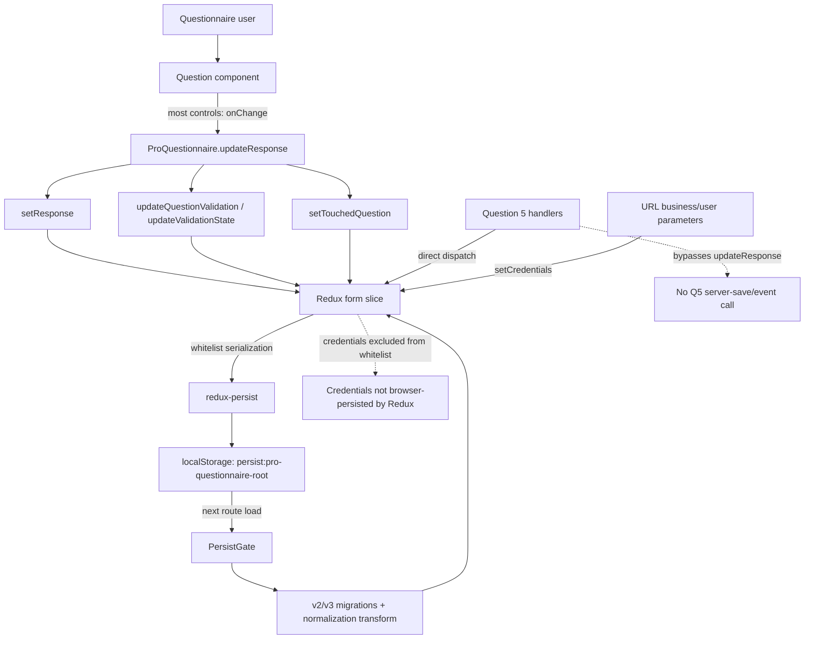
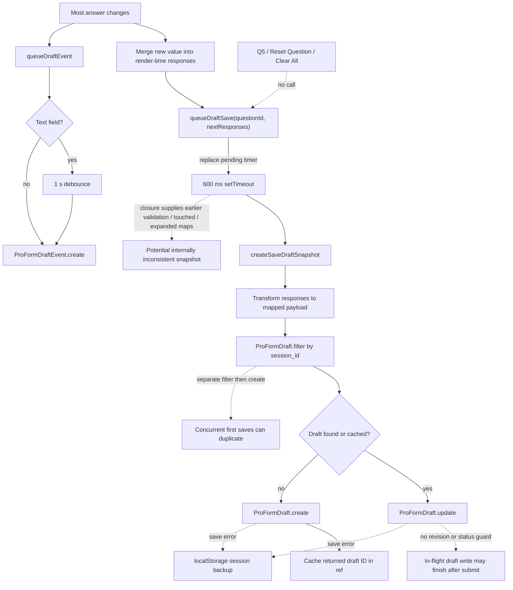
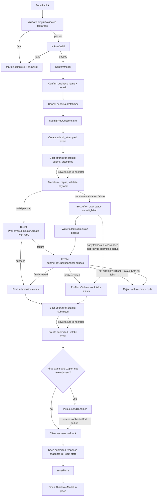
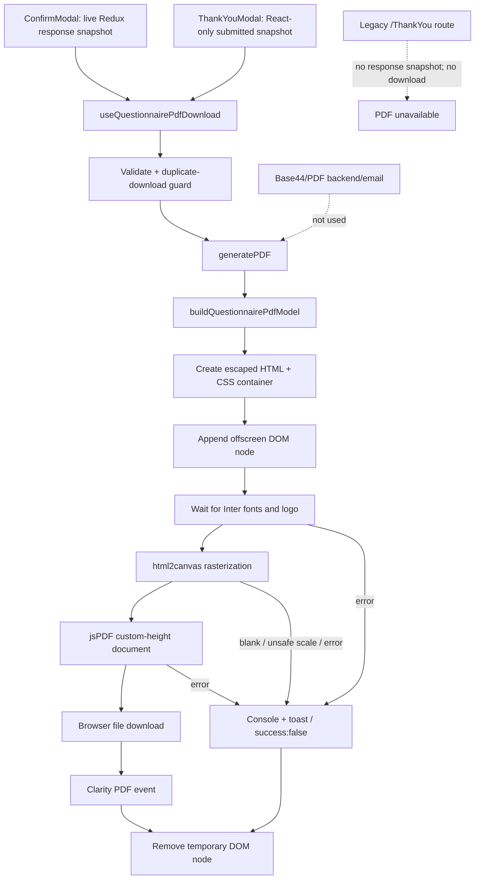
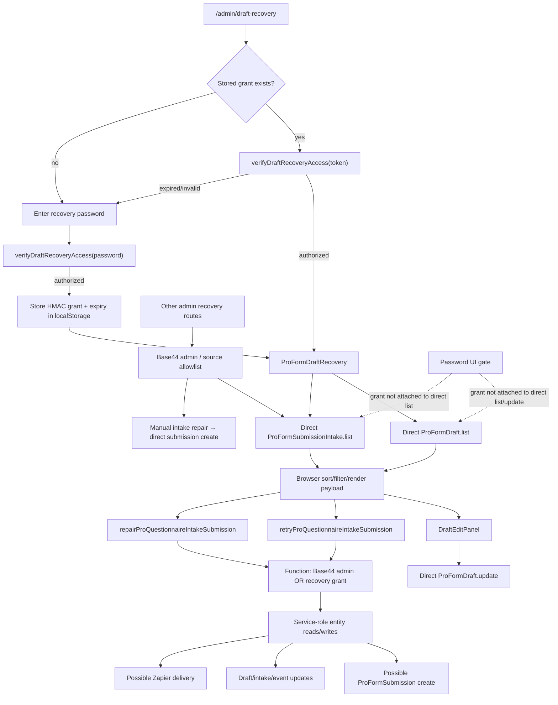
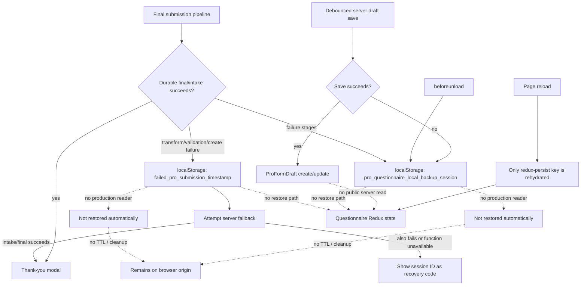

# Current data-flow diagrams

Status: static “as implemented” diagrams 
Branch/revision: `feature/durable-draft-recovery` at `73ece4c` 
Audit date: 2026-08-05

These diagrams describe current source behavior. Red/dashed paths identify gaps or non-durable steps; they are not proposed designs.

## 1. Client answer → Redux → browser storage

The persisted browser key is not namespaced by user, client, business, or session. `responses`, validation, touched, expanded, and text-validation metadata are persisted; credentials are excluded.

## 2. Client answer → ProFormDraft and event

The filter in this path locates a write target; it does not hydrate the questionnaire from a server draft.

## 3. Current submission path

The source reports a fallback-created intake as a successful durable receipt. The required fallback function exists locally but was absent from the read-only remote function-name listing on the audit date.

## 4. Current PDF path

PDF generation is entirely in the browser and does not persist or email the PDF.

## 5. Current admin recovery path

Retry and repair functions reauthorize before service-role access. Direct entity list/update calls rely on entity policy, not on the recovery grant.

## 6. Current failure and backup path

The backup writers are defensive evidence capture, not an implemented recovery mechanism.
