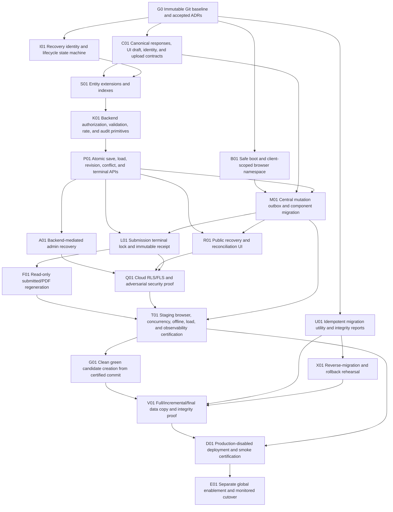

# Durable Draft Recovery Implementation Dependency Map

- Date: 2026-08-05
- Input baseline: `27ddc347d55db00796a0e3e19ac343245519b01e`
- Audit classification: **AUDIT_COMPLETE_WITH_REPRODUCTION_GAPS**
- Current-system verdict: **CURRENT_DRAFT_RECOVERY_NOT_PRODUCTION_RELIABLE**

This map orders implementation and release evidence. It does not authorize a Base44 deployment, schema change, production-data operation, integration change, or domain cutover.

## Dependency rules

1. Accepted ADRs and the immutable source baseline are prerequisites, not implementation evidence.
2. Client recovery must not be built on direct entity access; backend identity, authorization, and persistence primitives come first.
3. The canonical state contract precedes schema/API work so the server does not preserve an incomplete client model.
4. Centralized mutations precede broad UI migration and acceptance testing.
5. Submission terminality precedes durable receipt/PDF regeneration.
6. Staging certification precedes creation of the clean green production candidate.
7. Migration and reverse-migration proof precede production-disabled deployment and domain cutover.
8. Feature enablement is a separate approval after the deployed-disabled candidate passes production-safe checks.

## Directed acyclic graph

The graph has no back-edge: implementation flows from baseline/contracts to backend primitives, then clients/security/certification, then clean-environment migration and activation.

## Ordered implementation and gate table

| Order | Node | Deliverable | Depends on | Blocks | Required exit evidence |
| ---: | --- | --- | --- | --- | --- |
| 0 | G0 | Immutable rollback tag/commit, accepted ADR-001/002/003, traceability controls | — | All work | Baseline validation and rollback-point proof remain intact. |
| 1 | B01 | Guarded bootstrap, scoped storage keys, safe legacy-state quarantine/migration | G0 | M01 | Storage-fault and cross-client isolation tests pass. |
| 2 | C01 | Canonical JSON contracts for answers, UI draft state, identity, validation, and upload metadata | G0 | S01, M01 | Field/state/serialization contract acceptance tests pass; raw browser objects excluded. |
| 3 | I01 | Session/recovery identity, generation/supersession, lifecycle and retention state machine | G0 | S01 | Threat model and state-transition table approved. |
| 4 | S01 | Backward-compatible draft/event/submission fields, unique/index support, migration-safe defaults | C01, I01 | K01 | Schema validation and compatibility tests pass in staging. |
| 5 | K01 | Shared backend authorization, validation, payload minimization, rate control, structured audit logging | S01 | P01 | Unit/contract tests and deny-by-default cases pass. |
| 6 | P01 | Atomic idempotent save/load, revisions/CAS, conflict result, clear/supersede, terminal-status guard | K01 | M01, R01, L01, A01 | Concurrency, retry, stale revision, and terminal regression tests pass. |
| 7 | M01 | Render-independent local journal/outbox; all Q5/reset/clear/conditional/editor mutations use one pipeline | B01, C01, P01 | R01, L01, T01 | Mutation matrix acceptance suite proves local/server/event equivalence. |
| 8 | R01 | Public authorized recovery, source comparison, safe user choice, deterministic hydration | P01, M01 | Q01 | Same/cross-browser recovery, malformed data, identity mismatch, and no-leak tests pass. |
| 9 | L01 | Immutable submit-attempt snapshot, idempotent finalization/intake receipt, monotonic terminal state | P01, M01 | F01, Q01 | Retry/fallback/delayed-write tests prove one terminal outcome. |
| 10 | F01 | Reload-safe read-only submitted receipt and PDF regeneration | L01 | T01 | Receipt authorization and byte/model equivalence tests pass after reload. |
| 11 | A01 | Backend-mediated admin search/read/repair with least privilege and audit records | P01 | Q01 | Admin grant/role matrix and mutation audit tests pass. |
| 12 | Q01 | Cloud RLS/FLS and adversarial public/admin authorization certification | A01, R01, L01 | T01 | Cross-client and unauthorized entity/function tests fail closed in staging. |
| 13 | T01 | Full staging certification across native browsers, lifecycle/offline, multi-tab, concurrency, performance/load, observability, and rollback hooks | F01, Q01, M01 | G01, D01 | Production acceptance checklist has complete evidence and no release blocker. |
| 14 | U01 | Idempotent bidirectional migration tooling, ID maps, checkpoints, hashes, relationship/file validation | G0 | X01, V01 | Synthetic/sanitized staging reruns prove no duplicates and complete integrity reports. |
| 15 | X01 | Green-to-blue reverse migration and rollback rehearsal | U01 | V01 | Representative reverse counts/hashes/relationships pass with zero unresolved errors. |
| 16 | G01 | Clean `Pro Website Questionnaire_next` from exact staging-certified Git commit; no staging data/config | T01 | V01 | App/environment manifest and commit equivalence proof. |
| 17 | V01 | Initial and incremental migration, final-freeze delta plan, file/reference verification | G01, U01, X01 | D01 | Per-entity counts/hashes/relationships and no-test-data proof pass. |
| 18 | D01 | Feature-disabled green deployment, temporary-URL smoke/security/integration certification | V01, T01 | E01 | Disabled-by-default proof, health, SSL/route rehearsal, and rollback readiness pass. |
| 19 | E01 | Separately approved enablement, controlled freeze/final delta/domain cutover, late-write reconciliation | D01 | — | Automated final integrity gates, monitored thresholds, and preserved blue fallback. |

## Batch alignment

| Implementation batch | Dependency nodes | Current defects primarily retired |
| --- | --- | --- |
| B01 — Safe boot and local isolation | B01, C01, I01 | DRAFT-001, -002, -003, -005, -006, -017, -018 |
| B02 — Atomic canonical persistence | S01, K01, P01, M01 | DRAFT-007, -008, -009, -011, -012, -015, -016, -019 |
| B03 — Public recovery | P01, R01 | DRAFT-004, -005, -013, -014, -017 |
| B04 — Clear and terminal submission | P01, L01 | DRAFT-010, -016 |
| B05 — Admin/security boundary | A01, Q01 | DRAFT-010, -014, -017 |
| B06 — Integrated certification | F01, T01 | All release-blocking defects and reproduction gaps |
| Release migration/cutover | U01, X01, G01, V01, D01, E01 | Environment/data continuity and rollback risks |

## Stop gates

Implementation or release stops when any prerequisite evidence is absent. In particular:

- no direct browser entity access may be accepted as the future authorization boundary;
- no public recovery UI precedes authorized backend load semantics;
- no terminal submission or clear flow ships without stale-revision/status protection;
- no green candidate is created from an uncertified commit;
- no production-data migration occurs without idempotent forward and proven reverse paths;
- no production domain moves before final-delta integrity passes;
- no feature is enabled merely because code was deployed.

## Evidence references

- [Current system audit report](./current-system-audit-report.md)
- [Current defect register](./current-defect-register.md)
- [Draft mutation matrix](./draft-mutation-matrix.md)
- [Component-local state audit](./component-local-state-audit.md)
- [ADR-002 blue/green cutover and data continuity](../architecture/ADR-002-blue-green-base44-cutover-and-data-continuity.md)
- [Production acceptance criteria](../release/production-acceptance-criteria.md)
