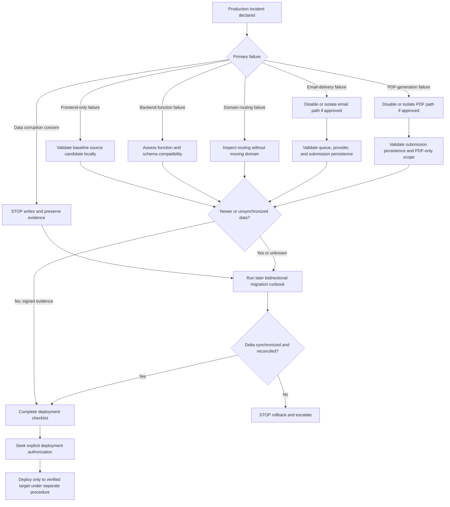

# Source and Application Rollback Runbook

## Purpose and scope

This runbook prepares an incident team to return the Pro Website Questionnaire source to the approved pre-recovery baseline without confusing that Git operation with a Base44 deployment, data rollback, or domain move.

These are four separate operations:

| Rollback lane | What it changes | Readiness |
| --- | --- | --- |
| Source-code rollback | Creates a Git branch whose tree is the approved baseline | Rehearsed locally from remote GitHub artifacts |
| Base44 application deployment rollback | Deploys approved source to a specifically identified Base44 app | Not rehearsed or authorized by the baseline prompts |
| Database/data rollback | Reconciles or restores records written before and after cutover | Not ready; reserved for the later bidirectional blue/green migration utility |
| Domain rollback | Reassigns production routing between blue and green apps | Not rehearsed; requires a later explicit cutover procedure |

Source rollback alone does not restore or reconcile database records written after a future cutover. It also does not deploy the source or move a domain.

## RLS-compatible staging rollback rule

An RLS-hardened staging app may roll back only to a commit independently certified with `DRAFT_RLS_CERTIFIED_IN_STAGING`. The pre-durable baseline is a blue-production fallback reference, not a deployable predecessor for the hardened staging schema. Before any staging source rollback, run `npm run release:precheck-staging-rollback`, preserve a backup/checkpoint, activate the bounded kill switch, prove no migration lease or replacement is active, and follow the [staging drill plan](./staging-application-rollback-drill-plan.md). The 2026-08-06 attempt is blocked because no certified compatible predecessor or complete staging target evidence exists.

## Approved baseline references

- Repository: `https://github.com/themarketingteam/pro-website-questionnaire.git`
- Immutable tag: `pre-durable-draft-recovery-2026-08-05`
- Immutable backup branch: `backup/pre-durable-draft-recovery-2026-08-05`
- Approved SHA: `27ddc347d55db00796a0e3e19ac343245519b01e`
- Expected root tree: `40c3ed4e05e1ba228eb6781b4d2c4c6bf7f8932f`
- Baseline manifest: [source-baseline-manifest.md](../baseline/source-baseline-manifest.md)
- Independent validation: [source-baseline-validation.md](../baseline/source-baseline-validation.md)
- Remote-origin rehearsal: [source-rollback-rehearsal.md](../baseline/source-rollback-rehearsal.md)

The tag and backup branch must remain immutable. Never move, delete, recreate, or force-update either reference.

## Prerequisites and required access

Before beginning, obtain:

- An incident or change ticket with Isaac as owner or explicit delegate.
- GitHub read access to fetch the tag and backup branch.
- GitHub branch/PR access only if an approved emergency source branch must later be published.
- Node and npm capable of running the committed npm lockfile.
- A clean temporary directory with enough space for `node_modules` and `dist`.
- The source-baseline manifest and validation report.
- A named Base44 operator, data owner, domain owner, and support contact before any later cloud action.
- The exact target Base44 app identity and environment, verified without exposing tokens.
- An approved maintenance, write-freeze, and communication window if the incident could affect writes or routing.

GitHub source access does not grant permission to deploy, access production data, or move a domain.

## Verify the immutable remote references

Run from a trusted clone after fetching current remote state:

```bash
git fetch --all --tags --prune
git ls-remote --tags origin \
  'refs/tags/pre-durable-draft-recovery-2026-08-05' \
  'refs/tags/pre-durable-draft-recovery-2026-08-05^{}'
git ls-remote --heads origin \
  refs/heads/backup/pre-durable-draft-recovery-2026-08-05
```

The annotated tag object may have its own SHA. The peeled tag line ending in `^{}` and the backup branch must both be exactly:

```text
27ddc347d55db00796a0e3e19ac343245519b01e
```

STOP if either remote reference is missing, resolves to another SHA, or disagrees with the manifest. Do not repair an immutable reference during an incident.

## Retrieve and verify the baseline independently

Use a fresh clone so the rehearsal or incident does not depend only on a developer's local object database:

```bash
rollback_clone_dir="$(mktemp -d /tmp/pro-questionnaire-rollback.XXXXXX)"
git clone --no-checkout \
  https://github.com/themarketingteam/pro-website-questionnaire.git \
  "$rollback_clone_dir/repository"
git -C "$rollback_clone_dir/repository" fetch origin \
  tag pre-durable-draft-recovery-2026-08-05
git -C "$rollback_clone_dir/repository" fetch origin \
  refs/heads/backup/pre-durable-draft-recovery-2026-08-05:refs/remotes/origin/backup/pre-durable-draft-recovery-2026-08-05
git -C "$rollback_clone_dir/repository" checkout --detach \
  pre-durable-draft-recovery-2026-08-05
git -C "$rollback_clone_dir/repository" rev-parse HEAD
git -C "$rollback_clone_dir/repository" status --short
```

HEAD must be the approved SHA and status must be empty. Do not commit in this clone.

Verify the fetched backup branch independently:

```bash
git -C "$rollback_clone_dir/repository" switch --detach \
  refs/remotes/origin/backup/pre-durable-draft-recovery-2026-08-05
git -C "$rollback_clone_dir/repository" rev-parse HEAD
git -C "$rollback_clone_dir/repository" rev-parse 'HEAD^{tree}'
```

The commit and root tree must match the approved tag.

## Create an emergency rollback branch without rewriting main

Create a new branch in a separate worktree. Use a unique incident suffix rather than reusing a prior emergency branch name:

```bash
rollback_branch="emergency/rollback-$(date -u +%Y%m%dT%H%M%SZ)"
rollback_worktree="$(mktemp -d /tmp/pro-questionnaire-emergency.XXXXXX)"
git fetch --all --tags --prune
git worktree add -b "$rollback_branch" \
  "$rollback_worktree" \
  pre-durable-draft-recovery-2026-08-05
git -C "$rollback_worktree" rev-parse HEAD
git -C "$rollback_worktree" rev-parse 'HEAD^{tree}'
git -C "$rollback_worktree" status --short
```

Expected HEAD is the approved SHA, expected tree is `40c3ed4e05e1ba228eb6781b4d2c4c6bf7f8932f`, and status is empty. This does not reset or rewrite `main` or the active feature branch.

Do not push the emergency branch until the incident owner confirms that publishing it cannot trigger an automatic deployment. Never force-push. Never push the baseline tag or backup branch.

## Install, validate, and build the baseline

From the clean rollback checkout:

```bash
npm config get registry
npm ci
./node_modules/.bin/vitest run --config src/vitest.config.js
npm run lint
npm run typecheck
npm run build
```

The immutable baseline currently has known test, lint, and type-check failures documented in the validation report. `npm ci` and `npm run build` must still succeed. STOP if installation or build fails, the lockfile changes, the build output secret scan fails, or observed failures materially differ from the recorded baseline without explanation.

Expected build characteristics are:

- Output directory: `dist/`
- File count: 56
- Total size: 2,328,920 bytes
- Deterministic build-manifest SHA-256: `fa7824d49f628c6228b1640a2ba71f4e19fe096731eae7544abb2aaf4670d98b`

Do not add `node_modules/` or `dist/` to Git.

## Smoke-test the baseline locally

Serve only the compiled local build:

```bash
npm run preview -- --host 127.0.0.1 --port 4173 --strictPort
```

Open `http://127.0.0.1:4173/` and verify:

- HTTP status is 200.
- The heading `MSP Success - Pro | Website Content Questionnaire` is visible.
- `Validation Status Guide` is present.
- No immediate JavaScript crash or console error occurs.
- No form is submitted and no production integration is invoked.

Stop the preview server after evidence is captured.

## Prepare a Base44 source rollback without deploying

Preparation stops before any Base44 cloud command:

1. Verify the emergency branch commit and tree against the approved tag.
2. Attach install, test, lint, type-check, build, secret-scan, and preview evidence to the incident ticket.
3. Identify the exact blue and green Base44 apps by approved non-secret identifiers.
4. Determine whether either app has received writes since cutover.
5. Determine whether the old source is compatible with the current backend schema and secrets.
6. Confirm which repository event, branch merge, or operator action could trigger deployment.
7. Prepare a reviewed rollback PR or deployment candidate without merging it, pushing `main`, or invoking Base44 deployment.
8. Proceed only after the pre-deployment and data-protection checkpoints below are signed off.

Creating or publishing a source branch is not proof of a Base44 deployment rollback.

## Mandatory pre-deployment checklist

- [ ] Incident owner and change ticket recorded.
- [ ] Remote tag and backup branch reverified at the approved SHA.
- [ ] Fresh-clone install and build pass.
- [ ] Known failures match the baseline report; no new blocker exists.
- [ ] Build-output secret scan passes.
- [ ] Local preview passes without a submission.
- [ ] Exact Base44 target app and environment are unambiguous.
- [ ] Blue production app remains intact and recoverable.
- [ ] Green app state, deployment, schema, integrations, and write activity are inventoried.
- [ ] Auto-deploy triggers for branch publication or merge are understood.
- [ ] Email, Zapier, PDF, and admin-recovery dependencies have named validators.
- [ ] Maintenance/write-freeze window is approved when writes may be affected.
- [ ] Data-protection checkpoint is complete.
- [ ] Domain routing will remain unchanged during source-only work.
- [ ] Monitoring, rollback validation, and abort owners are assigned.
- [ ] Explicit authorization exists for any later Base44 deployment.

## Mandatory data-protection checkpoint

The existing blue production app must remain intact. After a future cutover, the green app may contain newer records that do not exist in blue. Moving the domain back or deploying old behavior before reverse synchronization could hide, strand, duplicate, or corrupt those records.

Before any deployment or domain move:

1. Identify the authoritative write side and the exact cutover timestamp.
2. Freeze or otherwise control new writes on both sides.
3. Produce counts and identifiers for records created or changed after cutover.
4. Preserve approved backups/exports and integrity metadata.
5. Run the later green-to-blue delta migration utility in dry-run mode.
6. Review conflicts, failures, and idempotency evidence.
7. Execute the approved migration only under its own runbook and authority.
8. Reconcile counts, identifiers, checksums, and representative records.
9. Obtain data-owner sign-off before deployment or domain reassignment.

Database rollback is reserved for the later bidirectional blue/green migration utility. Git restoration must never be represented as database rollback readiness.

## STOP conditions

Stop the rollback and escalate if any of these are true:

- The tag, backup branch, manifest, or expected tree disagree.
- The baseline cannot be freshly installed or built.
- A secret or credential is detected in source, build output, logs, or documentation.
- The exact Base44 target is ambiguous.
- The blue production app is missing, changed unexpectedly, or not recoverable.
- Green may contain newer writes and reverse synchronization is incomplete or unverified.
- Writes cannot be frozen or safely reconciled.
- The old source is incompatible with the current data schema or required backend functions.
- Data backups, migration evidence, or data-owner approval are missing.
- Domain state or ownership is unclear.
- An automatic deployment could be triggered unintentionally.
- Required incident, deployment, data, or domain approval is absent.

Do not bypass a STOP condition by moving the domain, force-pushing, resetting `main`, deleting records, or guessing a migration result.

## Incident decision tree



Guidance by symptom:

- Frontend-only failure: prefer a source candidate and local validation; do not touch data or routing merely to fix presentation.
- Backend-function failure: verify schema and integration compatibility before considering old functions.
- Data-corruption concern: stop writes, preserve evidence, and use the later migration/data-recovery runbook.
- Domain-routing failure: diagnose DNS and app bindings first; do not move the domain before reverse synchronization.
- Email-delivery failure: preserve successful submissions, inspect the provider/queue, and use an approved feature disablement before broad rollback.
- PDF-generation failure: isolate PDF behavior when possible; do not roll back records or routing for a PDF-only failure.

## Expected validation after an authorized rollback

Use approved synthetic test data and the designated non-production or controlled production validation path. Record every result:

- [ ] Questionnaire loads at the intended route.
- [ ] Existing draft save and resume path works.
- [ ] Submission persists once without duplication.
- [ ] Downstream delivery status is observable without leaking content.
- [ ] PDF generation works and produces the expected document.
- [ ] Admin recovery can locate and safely act on the synthetic record.
- [ ] No unexpected console, function, authentication, or permission error occurs.
- [ ] Monitoring, logs, record counts, and domain routing match the approved target.

## Later-command placeholders

### Green-to-blue delta migration

The utility is now locally implemented, but these examples remain
non-authorizing. First verify a `green_to_blue` route and confirm no active
`blue_to_green` lease:

```text
npm run migration:blue-green -- reverse --dry-run
npm run migration:blue-green -- verify
```

Apply is permitted only under a separately approved incident/data procedure:

```text
npm run migration:blue-green -- reverse --apply --confirm APPLY_GREEN_TO_BLUE_MIGRATION
```

Stop before domain reversal unless the reverse run has two quiet passes, zero
open conflicts/unresolved relationships/file blockers, and the complete
verification report says `PASS`. Preserve blue-origin IDs through the reverse
map, create one blue record for green-native origins, quarantine independent
blue changes, preserve submitted state, and perform no delete.

### Domain reassignment

`[PLACEHOLDER — DO NOT EXECUTE]` Insert the approved Base44/DNS ownership checks, TTL plan, reassignment steps, propagation validation, and reversal criteria from the later domain cutover runbook. Never move the domain while newer green records remain unsynchronized.

### Base44 support escalation

`[PLACEHOLDER]` Record the support channel, severity definition, app identifiers, incident ticket, deployment identifiers, sanitized logs, timestamps, and escalation owner. Never place access tokens or customer data in the ticket.

### Emergency feature-flag disablement

`[PLACEHOLDER — DO NOT EXECUTE]` Record only flags that actually exist, their owners, default states, target app, audit evidence, and restoration procedure. Do not invent a flag or use a flag change to bypass the data checkpoint.

## Communication checklist

- [ ] Isaac and the incident commander acknowledge the incident scope.
- [ ] Support staff receive the incident ID, user impact, and current safe action.
- [ ] Engineering names the source, Base44, data, domain, email, and PDF owners.
- [ ] The authoritative app and write-freeze status are communicated.
- [ ] The approved baseline SHA and candidate branch are communicated.
- [ ] Known baseline failures and new findings are distinguished.
- [ ] Deployment, data synchronization, and domain decisions have separate approvals.
- [ ] Customer-facing communication avoids unsupported recovery claims.
- [ ] Validation results and remaining risks are posted after each controlled phase.
- [ ] The incident is not closed until owners confirm data, routing, integrations, and monitoring.

## Evidence retention

Retain, under the organization's incident-retention policy:

- Sanitized `ls-remote`, clone, checkout, SHA, and tree evidence.
- Exact commands, exit codes, UTC timestamps, toolchain versions, and registry URL.
- Install, test, lint, type-check, build, secret-scan, and preview summaries.
- Build manifest and SHA-256.
- Emergency branch and PR identifiers.
- Approved non-secret app identifiers and deployment IDs.
- Redacted Base44, function, browser-console, provider, and DNS logs.
- Write-freeze timestamps, backup/export IDs, migration dry runs, conflict reports, record counts, and reconciliation checksums.
- Deployment, data, domain, and support approvals.
- Post-rollback validation evidence and final incident timeline.

Do not retain credentials, `.env` contents, raw recovery passwords, access tokens, customer questionnaire content, or credential-bearing URLs in Git.

## Current rehearsal statement

The rehearsal that created this runbook retrieved and built source from GitHub, served it only on localhost, and created then deleted a local emergency branch. It did not run a Base44 command, deploy an application, access or modify a production record, move a domain, submit a questionnaire, send email or Zapier traffic, or generate a production PDF.
